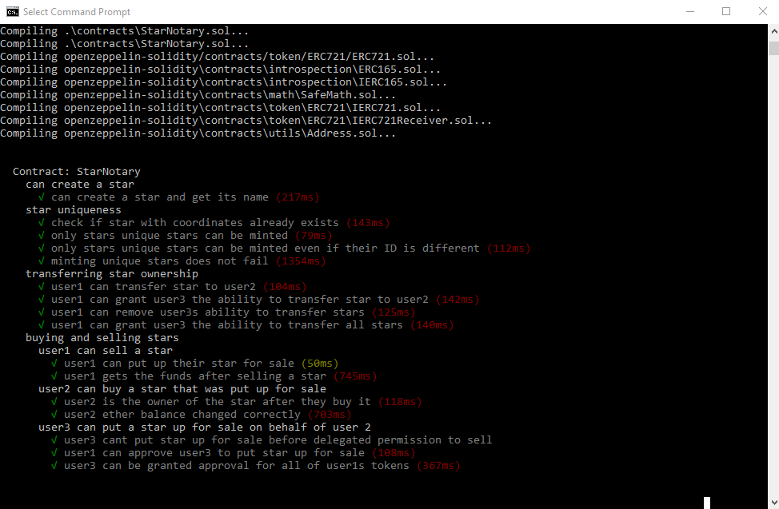
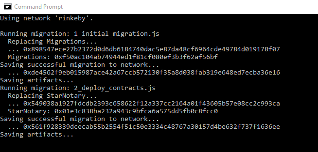
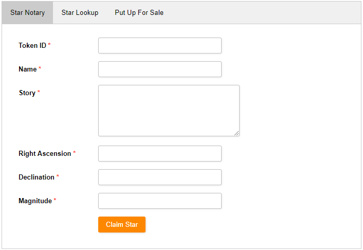
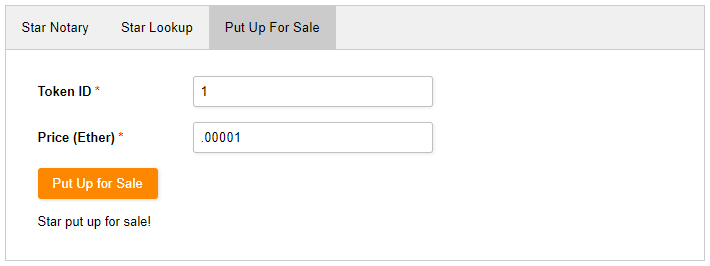
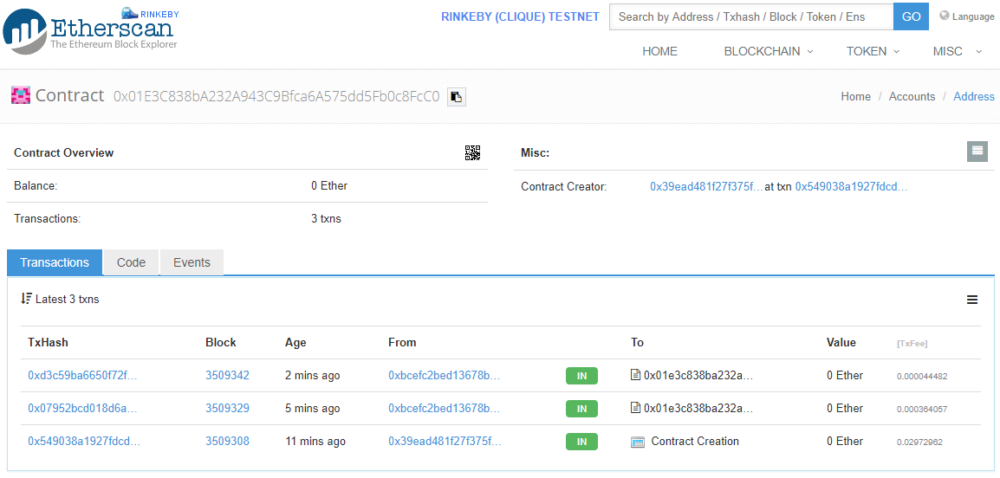
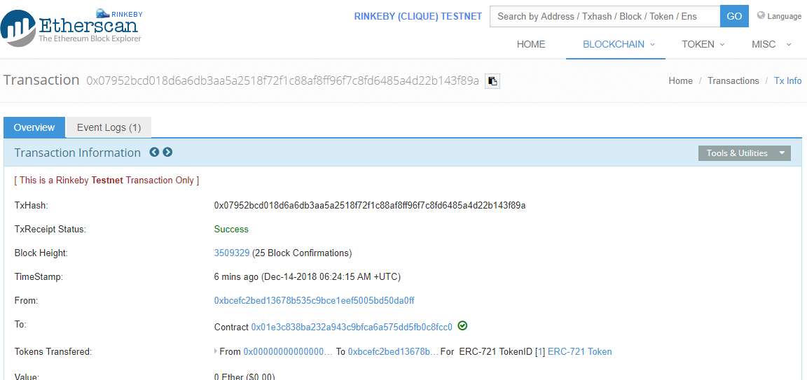

# **Ethereum Star Notary**

The goals of this project are as follows:

- Define and implement a [Solidity](https://github.com/ethereum/solidity) smart contract which implements the ERC-721 token interface.
- Define a token which represents a star.
- Prevents two tokens with the same star coordinates from being added.
- Create automated smart contract tests.
- Deploy the smart contract to the [Ethereum](https://www.ethereum.org/) RINKEBY test network.
- Create a web front-end that interacts with the deployed smart contract.

------


## Overview

This project is a Distributed Application (DApp) which includes an [Ethereum](https://www.ethereum.org/) smart contract  and a web front-end.  The smart contract is a notary service implemented with [Solidity](https://github.com/ethereum/solidity) which manages non-fungible "Star" tokens.


------

### Star Notary Smart Contract

The Star Notary smart contract ([StarNotary.sol](smart_contracts/contracts/StarNotary.sol)) is implemented using Solidity.  The contract inherits from a [ERC-721](http://erc721.org/) contract which defines a standard contract for non-fungible tokens.    The ERC-721 contract is imported from [OpenZeppelin](https://github.com/OpenZeppelin/openzeppelin-solidity) an open source library for smart contract development.

Star Notary extends ERC-721 ([StarNotary.sol](smart_contracts/contracts/StarNotary.sol) line 3) with the following functions:

| Function           | Location                                                | Description                                                  |
| ------------------ | ------------------------------------------------------- | ------------------------------------------------------------ |
| `createStar`       | [lines 19-42](smart_contracts/contracts/StarNotary.sol) | Allows an Ethereum account to create a new star token given values for the star name, story, right ascension, declination, magnitude, and token ID. |
| `putStarUpForSale` | [lines 44-48](smart_contracts/contracts/StarNotary.sol) | Puts the token up for sale.                                  |
| `buyStar`          | [lines 50-65](smart_contracts/contracts/StarNotary.sol) | Enables an Ethereum account to purchase the star token owned by another account for a given amount of ether. |

##### Star Struct

Star Notary includes a `struct` named `Star` ([StarNotary.sol](smart_contracts/contracts/StarNotary.sol) lines 7-13)which defines the star token attributes (name, story, right ascension, declination, and magnitude.)

##### createStar

The `createStar` function ensures new tokens include required star values and have unique coordinates  through the use of several `require` function calls  ([StarNotary.sol](smart_contracts/contracts/StarNotary.sol) lines 23-32).    The function enforces unique coordinates through the use of a Solidity "mapping" variable named `starHashToToken` which holds the hash values of every star token's combined right ascension (`_ra`), declination (`_dec`), and magnitude (`_mag`) values (`createStarHash` in [StarNotary.sol](smart_contracts/contracts/StarNotary.sol) lines 67-83).

The `createStar` function stores a "mapping",  `tokenIdToStarInfo`  ([StarNotary.sol](smart_contracts/contracts/StarNotary.sol) line 15), of each star's token ID to `Star` struct that can be used to lookup tokens by token ID.

##### putStarUpForSale

The `putStarUpForSale` function controls whether a Star token can be purchased.   It tracks the stars which are for sale using the `starsForSale` mapping variable  ([StarNotary.sol](smart_contracts/contracts/StarNotary.sol) lines 16 and 47).   The mapping variable holds the star token ID the sale price of the star.

##### buyStar

The `buyStar` function enables the purchase of star tokens.  The function first determines whether the star token can be purchased by checking the `starsForSale` mapping ([StarNotary.sol](smart_contracts/contracts/StarNotary.sol) line 51).  If the star token is available for purchase the function checks that the value paid exceeds the sales prices of the star ([StarNotary.sol](smart_contracts/contracts/StarNotary.sol) lines 53-54).  It then transfers the ownership of the token from the current owner to the new owner ([StarNotary.sol](smart_contracts/contracts/StarNotary.sol) lines 56-60) and returns change to the purchasing account  ([StarNotary.sol](smart_contracts/contracts/StarNotary.sol) lines 62-64).

------

### Smart Contract Unit Tests

Unit tests are located within [StarNotaryTest.js](smart_contracts/test/StarNotaryTest.js).  They are implemented in JavaScript using the [Truffle](https://truffleframework.com/) framework.  The tests can be run by starting [Ganache](https://truffleframework.com/ganache) and executing the following commands from the main project folder.

```bash
cd smart_contracts
truffle test
```

Truffle will compile the solidity contracts located under `smart_contracts/contracts` , the deploy the contracts to Ganache and execute the tests located under `smart_contracts/test`. An image of the truffle test execution is below.




------

### Deploying to the Ethereum RINKEBY Test Network

Truffle is used to deploy the smart contracts to a target network.   The truffle configuration file ([truffle-config.js](smart_contracts/truffle-config.js)) controls where truffle deploys the project's contracts.   A screenshot of the [truffle-config.js](smart_contracts/truffle-config.js) file is shown below.  The config file contains deployment parameters for two networks: *development* and *rinkeby*.

```javascript
require('dotenv').config();
var HDWalletProvider = require('truffle-hdwallet-provider');
var infuraUrl = 'https://rinkeby.infura.io/v3/' + process.env.INFURA_API_KEY;

module.exports = {
  networks: { 
	development: {
		host: '127.0.0.1',
		port: 7545,
		network_id: "*"
	}, 
	rinkeby: {
        provider: function() {
            return new HDWalletProvider(process.env.MNEMONIC, infuraUrl) 
		},
      	network_id: 4,
        gas: 4500000,
        gasPrice: 10000000000,
    }
  }
};
```

The *rinkeby* network configuration tells Truffle to deploy the smart contracts to the RINKEBY test network through the [Infura](https://infura.io/) blockchain infrastructure.    The wallet mnemonic and RINKEBY API key values are retrieved from  [.env](smart_contracts/.env) file using the [dotenv](https://www.npmjs.com/package/dotenv) node.js module.

Running the following commands will initiate the deployment to the RINKEBY test network.

```bash
cd smart_contracts
truffle migrate --network rinkeby
```




------

### Web Front-End

The project includes an HTML test client ([image.html)](index.html) that interacts with the contract on the Ethereum RINKEBY test network.  The front-end uses the [Web3 Ethereum JavaScript API](https://web3js.readthedocs.io/en/1.0/) to create and retrieve star tokens on RINKEBY test through the [MetaMask](https://metamask.io/) browser plug-in.  

Here is a screen shot of the Star Notary tab.



After entering the required star data and clicking the "Claim Star" button MetaMask will prompt for confirmation as shown below. After confirming the request, MetaMask will submit the request.


Once the token creation has completed the star can put the star up for sale as shown in the screenshot below.



Once the contract creation transaction has completed the star can be retrieved using the "Star Lookup" tab as shown below.


------

### Star Notary Contract and Star Token Data

#### Contract Instance Details

The following table provides details of a Star Notary smart contract instance deployed to the test network.

| Property Name                      | Value                                                        |
| ---------------------------------- | ------------------------------------------------------------ |
| Contract Address                   | 0x01e3c838ba232a943c9bfca6a575dd5fb0c8fcc0                   |
| Contract Creation Transaction Hash | 0x549038a1927fdcdb2393c658622f12a337cc2164a01f43605b57e08cc2c993ca |


The contract details as shown on [Etherscan](https://rinkeby.etherscan.io/address/0x01e3c838ba232a943c9bfca6a575dd5fb0c8fcc0) are shown below.




#### Example Star Token Details

The following table provides details of an example Star token created by the Star Notary smart contract instance deployed to the test network.

| Property Name                        | Value                                                        |
| ------------------------------------ | ------------------------------------------------------------ |
| Star Token ID                        | 1                                                            |
| Star Token Creation Transaction Hash | 0x07952bcd018d6a6db3aa5a2518f72f1c88af8ff96f7c8fd6485a4d22b143f89a |


The contract details as shown on [Etherscan](https://rinkeby.etherscan.io/tx/0x07952bcd018d6a6db3aa5a2518f72f1c88af8ff96f7c8fd6485a4d22b143f89a) are shown below.




------


## Configuring the Project

#### Require Software

The following software must be installed on the host machine.

- Install [Ganache](https://truffleframework.com/ganache) 

  Download and install the version of Ganache for your operating system.

- Install [Truffle](https://truffleframework.com/truffle)

  Run the following command

  ```bash
  npm install truffle -g
  ```

- Install [MetaMax](https://metamask.io/)

  Install the MetaMask [Chrome extension](https://metamask.io/).

- Install Node.js dependencies

  The following node installation command should be executed from the project root directory.

  ```bash
  npm install
  ```

#### Infura Account

The project requires an Infura account. You can create one [here](https://infura.io/).


#### Create an .env file

The truffle test and migration process requires a file named *.env* to be located in the [smart_contracts](smart_contracts) folder.  This file must contain your wallet mnemonic and [Infura](https://infura.io/) API URL.

```bash
INFURA_API_KEY=<INFURA API KEY GOES HERE>
MNEMONIC="<WALLET MNEMONIC GOES HERE"
```

